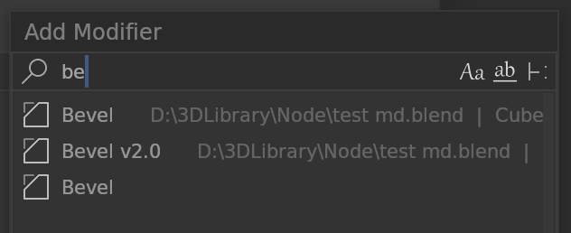
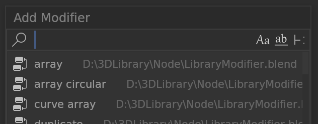
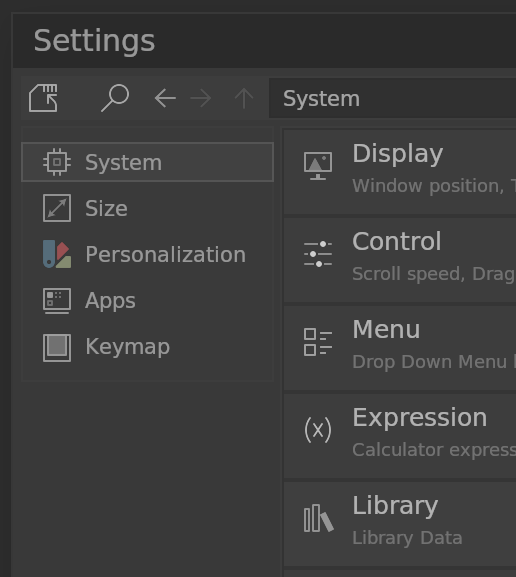
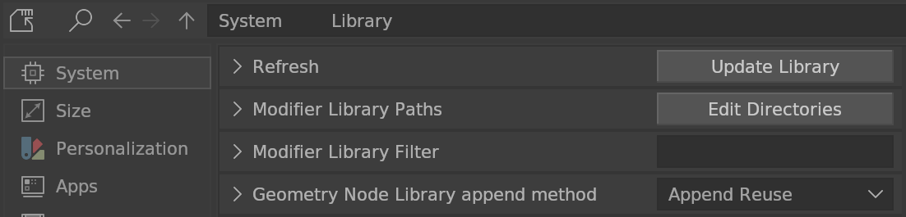
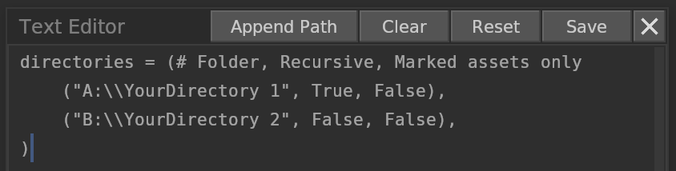
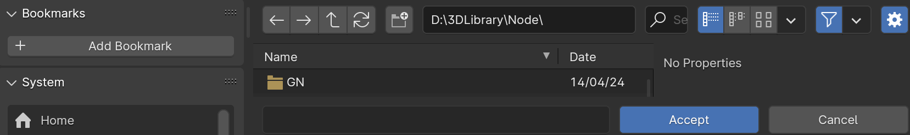

# Modifier Editor

There are two types of libraries that can be loaded from specific directories.
- Modifiers

    It will find all valid objects that containing modifiers in the library .blend files.

    

- Geometry node groups

    It will find all valid geometry node groups in the library .blend files.

    

## Modifier Library
To add a new library directory, you can perform the following steps:

Setting Editor > System > Library

Edit Directories

Clear > Append Path

Select a folder containing .blend files or subfolders.

Accept and Save from Text Editor.
