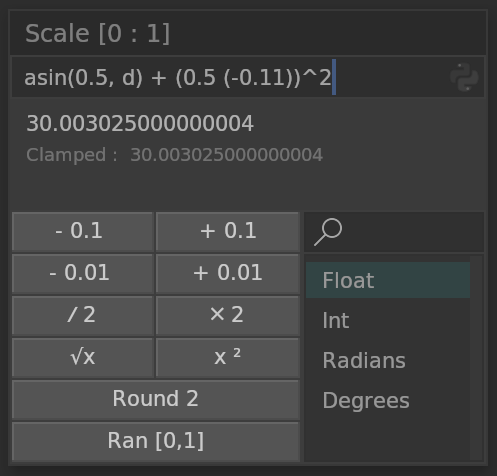
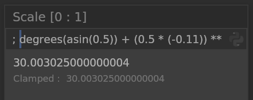
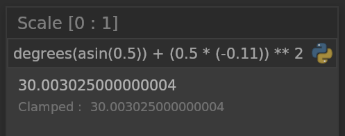
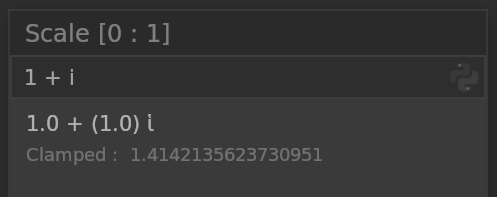
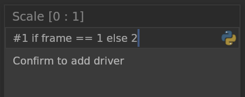

# Calculator

When input a value, general expressions and Python expressions are supported for calculation.  
The calculation accuracy is Python floating point precision.  
It also allows users to customize button functions.

When the Python Button is off, it can calculate the general expressions.

To using python expressions, You can add a semicolon at the beginning of the expression or enable the Python Button

Complex numbers can be evaluated using general expressions,  
and when the output is a complex number, it is converted to an absolute value.

To add a driver, you need to insert a hashtag before the expression.

