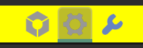
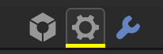

# Taskbar

## <!--py$r_color_name("box_tb")$-->Taskbar BG<!---->
<!--py$r_color_description("box_tb")$-->Taskbar background color<!---->

## <!--py$r_color_name("box_tb_multibar")$-->Taskbar Underline<!---->
<!--py$r_color_description("box_tb_multibar")$-->The appearance when there are more than 2 editors of the same type<!---->
