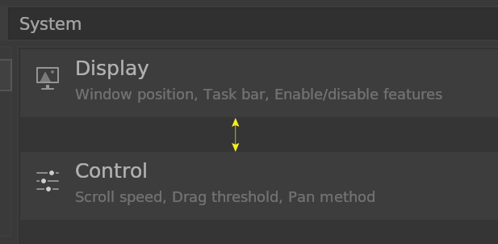
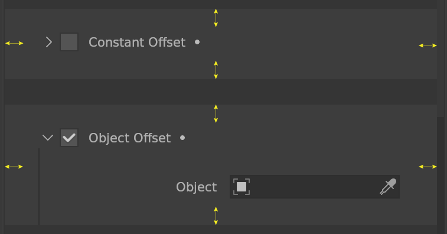
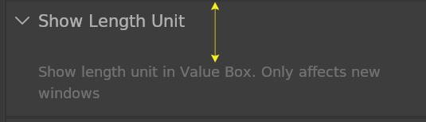
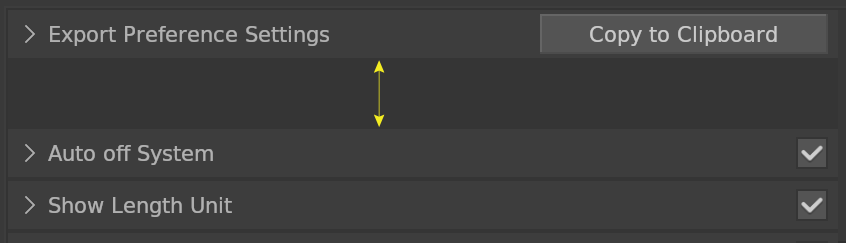
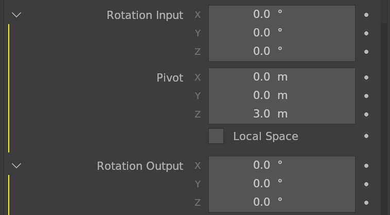

# Blocks

## Spacing

Block spacing. Default is 1 pixel.

## Border

Block border.

## Border Inner

Block inner border in Settings Editor. Default is 15 pixels.

## Separator

Block separator size. Default is 10 pixels.

## Guideline

Block guideline width. Default is 1 pixel.

