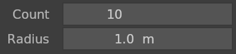
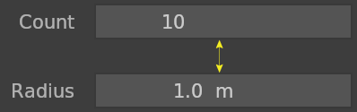
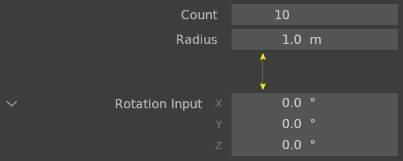
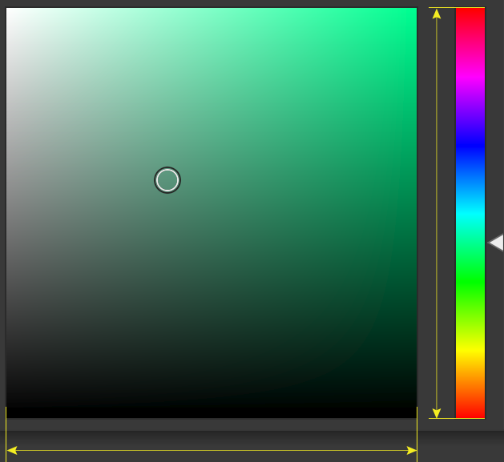

# Buttons

## Color Grid

Color properties alpha channel grid. Default is 8 pixels.

## Gap

Gap between Buttons. Default is 1 pixel.

 

## Separator

Button Separator. Default is 3 pixels.

## Hue

Color menu Hue area size. Default is 256 pixels.

