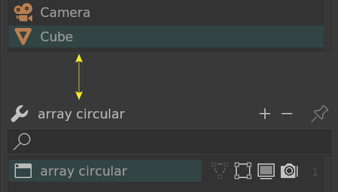
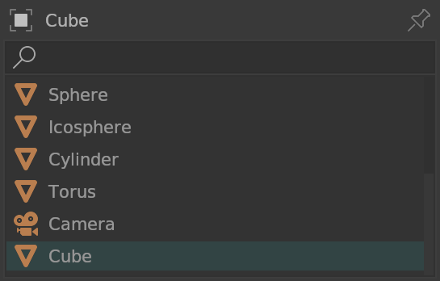
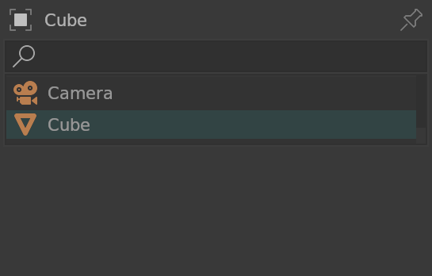
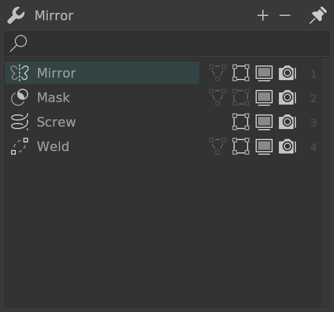
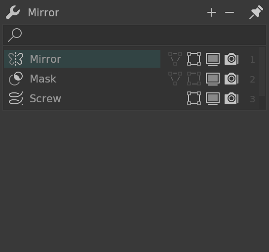
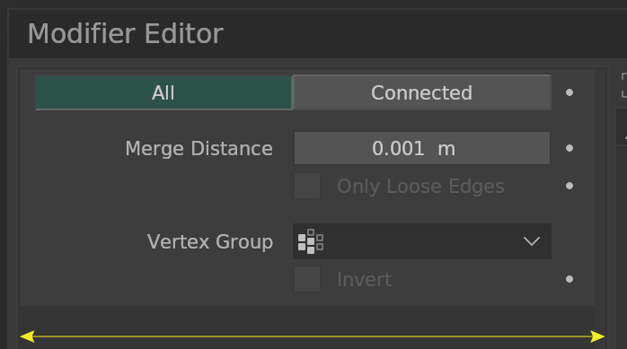
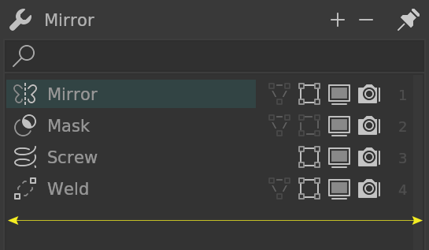
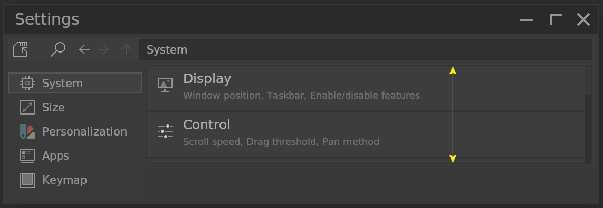

# Editor

## Modifier Editor

### Area List Inner

<!--py$P.ModifierEditor.bl_rna.properties["area_list_inner"].description$-->Additional distance between Object List and Modifier List<!---->.  
Default is <!--py$P.ModifierEditor.bl_rna.properties["area_list_inner"].default$-->8<!----> pixels.

### Area Rows (Objects)

Number of object filter rows.  
Default is <!--py$P.ModifierEditor.bl_rna.properties["area_rowlen_obj"].default$-->6<!---->.

### Area Rows (Modifiers)

Number of modifier list rows.  
Default is <!--py$P.ModifierEditor.bl_rna.properties["area_rowlen_mds"].default$-->10<!---->.

### Area Width Factor (Tab)

Width factor of Tab area.  
Default is <!--py$P.ModifierEditor.bl_rna.properties["area_widthfac_tab"].default$-->1.0<!---->.

### Area Width Factor (Filter)

Width factor of Filter area.  
Default is <!--py$P.ModifierEditor.bl_rna.properties["area_widthfac_filter"].default$-->1.0<!---->.

## Settings Editor

### Area Height

<!--py$P.SettingEditor.bl_rna.properties["area_height"].description$-->Settings Editor area height. The height is this value multiplied by Wedget Height. Effect only on new windows<!---->.  
Default is <!--py$P.SettingEditor.bl_rna.properties["area_height"].default$-->28<!---->.

