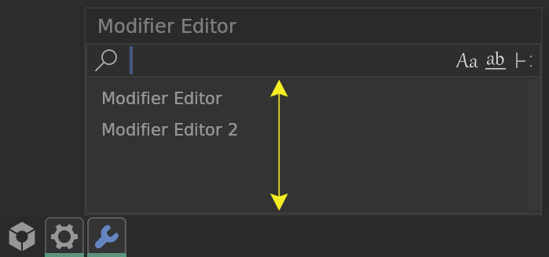
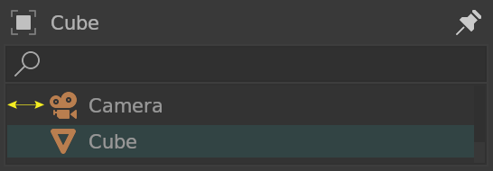
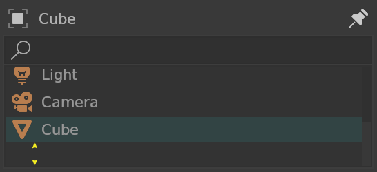
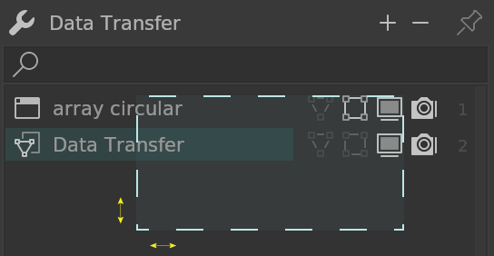

# Filter

## Height

Fliter background height. Default is 200 pixels, does not include borders.

## Border X

Fliter horizontal border. Default is 2 pixels

## Border Y

Fliter vertical border. Default is 2 pixels

## Select Box Gap

Filter Selection Gap, Default is 2 pixels

