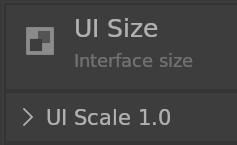
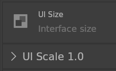

# Fonts

## Title

Title font size factor. default is 0.56.

 

## Subtitle

Subtitle font size factor. default is 0.7.

 

## Widget

Widget font size factor. default is 0.6.

 

## Label

Widget font size factor. default is 0.5.

 
