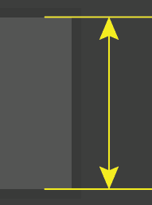
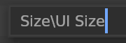
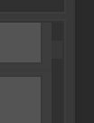
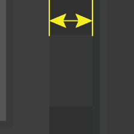
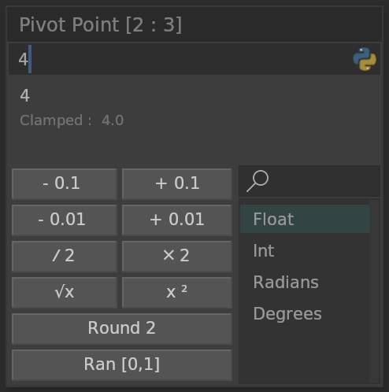

# Widget

## Height

Default is 18 pixels, does not include borders.

## Beam Cursor

I-Beam cursor width. Default is 2 pixels.

## Scrollbar

Scrollbar background width. Default is 6 pixels.

&nbsp;&nbsp;&nbsp;&nbsp;

## Spacing

Button spacing. Default is 1 pixel.

&nbsp;&nbsp;&nbsp;&nbsp;

