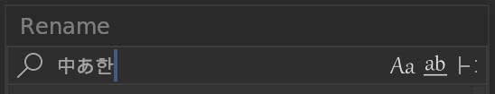

# **Limitations**

## Known issues and limitations

- The current version does not support IME input. But text can still be pasted.

    

- When the workspace changes / load a new blend file / switch to local or quad view, the subsystem will automatically close.

- When the Blender theme changes / add-on updated to new versions / reload event, Blender needs to be restarted to use the add-on.

- Changing length units or unit scale requires restarting the editor.