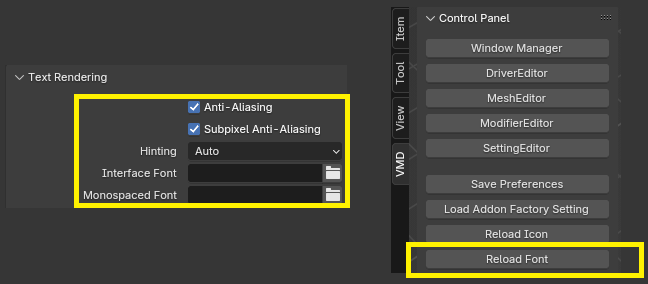
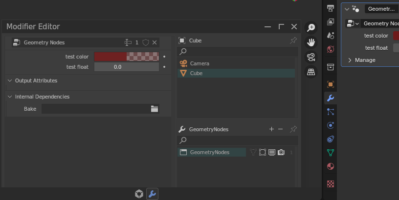

# **Limitations**

## Known issues and limitations

- The current version does not support IME input. But text can still be pasted.

    

- When the Blender theme or UI font is changed, you need to manually press "Reload Fonts".

    

- When the workspace changes / load a new blend file / switch to local or quad view, the subsystem will automatically close.

- Changing length units or unit scale requires restarting the editor.

- The preview of color properties for some colors is inaccurate.
  - Blender Foundation confirms there is an internal bug that prevents certain colors from being displayed in GPU module, some colors will display incorrectly in the UI until they are fixed.

  
