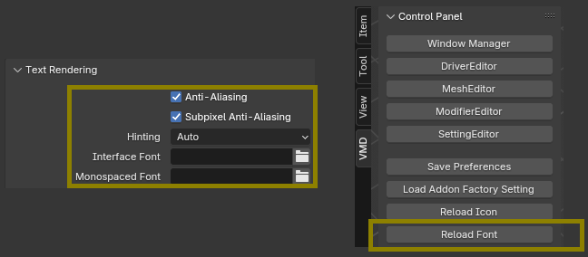

# **Limitations**

## Known issues and limitations

- The current version does not support IME input. But text can still be pasted.

    

- When the Blender theme or UI font is changed, you need to manually press "Reload Fonts".

    

- When the workspace changes / load a new blend file / switch to local or quad view, the subsystem will automatically close.

- Changing length units or unit scale requires restarting the editor.