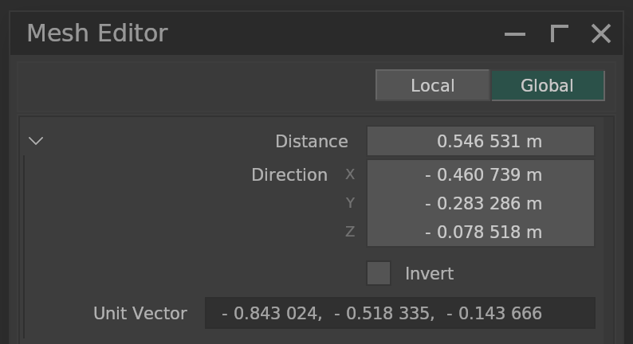
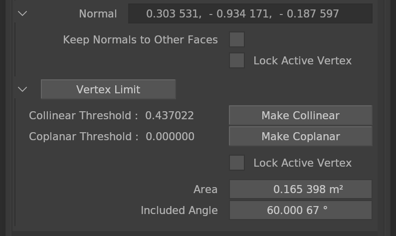

# **Mesh Editor**

Mesh Editor used in **edit mode** for mesh objects.

- **Distance**  
    Distance between 2 selected vertices  
    Unsigned Value

 

- **Direction**  
    Direction of 2 selected vertices  
    Point to active vertex when attribute **"Invert"** is disabled

 

- **Unit Vector**  
    Unit Direction

 

- **Normal**  
    Normal of 3 vertices or face
    - **Keep Normals to Other Faces**  
        Keep normals of unselected faces if possible
    - **Lock Active Vertex**  
        Keep active vertex location

 

- **Vertex Limit**  
    Deactivate the property when the selected vertex count exceeds this value

 

- **Collinear Threshold**  
    The smaller the value, the closer to collinear

 

- **Coplanar Threshold**  
    The smaller the value, the closer to coplanar

 

- **Make Collinear**  
    Make selected vertices collinear  
    - **Lock Active Vertex**  
        Keep active vertex location

 

- **Make Coplanar**  
    Make selected vertices coplanar  
    - **Lock Active Vertex**  
        Keep active vertex location

 

- **Area**  
    Total area of ​​selected faces
    - **Lock Active Vertex**  
        Keep active vertex location

 

- **Included Angle**  
    Unsigned angle between 2 edges. If 3 vertices selected, the angle will be based on the second selected vertex.
    When modifying the angle, the last selected vertex will move and maintain the length from the second vertex
    - **Lock Active Vertex**  
        Keep active vertex location