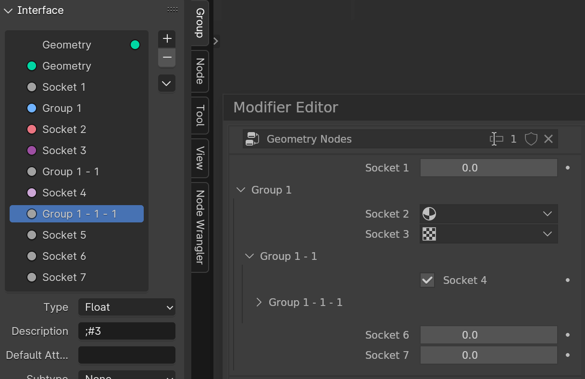
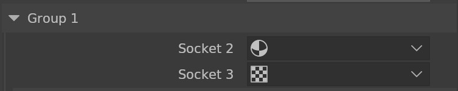
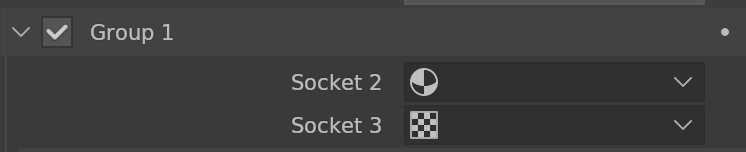
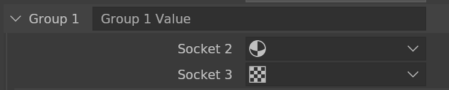
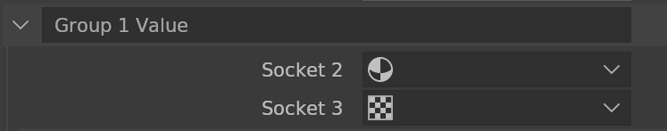
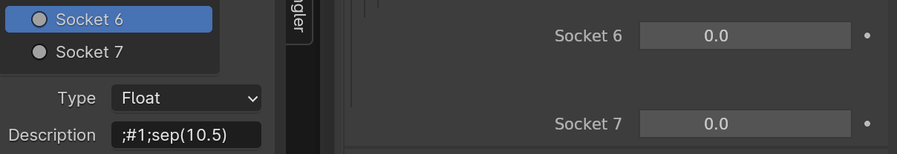

<div style="background-color: #909190; padding: 40px;">

# **Geometry Nodes**
The editor can add a new subgroup of Sockets, the format of which is stored in the socket description.



## Geometry Node Modifier Indentation Format

To use the Indentation Format, you need to add a semicolon at the beginning of the socket description.
```
;#0;sep(1);  Socket description..
```


### Indent
Indent to level 1.
```
;#1
```

### Unindent
Unindent to level 0.
```
;#0
```
---
### Header
Show title only when indented by default.



- Header Alignment
  - Show Title and Value on Header
    ```
    ;align()
    ```
    
  - Boolean
    

  - Show Title and Full Size Value
    ```
    ;align(fit)
    ```
    

  - Value Only
    ```
    ;align(full)
    ```
    
---

### Separator
```
;sep(x)
    Parameters:
        x (float)
```



### Alignment
 - Boolean

   - Default / Title Right
        ```
        ;align(right)
        ```
        

   - Title Left
        ```
        ;align(left)
        ```
        

