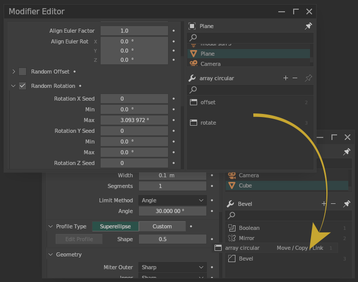
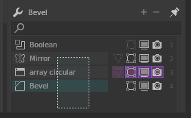
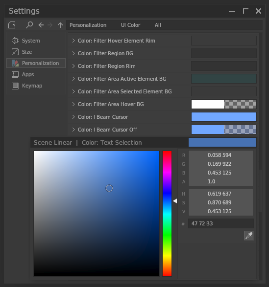

# **Introduction**

**vmdesk** and **vmdesk-Free** are a plug-in for a 3D software called blender,  
committed to improving user experience and providing new features.

## Download
- Standard version
    - [Blender Market](https://blendermarket.com/products/vmdesk)

- Free version
    - [Blender Market](https://blendermarket.com/products/vmdesk-free)
    - [GitHub](https://github.com/Iiispace/vmdesk)

## Brief

- Interactive multi-purpose processing
    - Move single/multiple modifiers in the modifier editor

    
    

 

- Customization
    - UI Color and Size

    