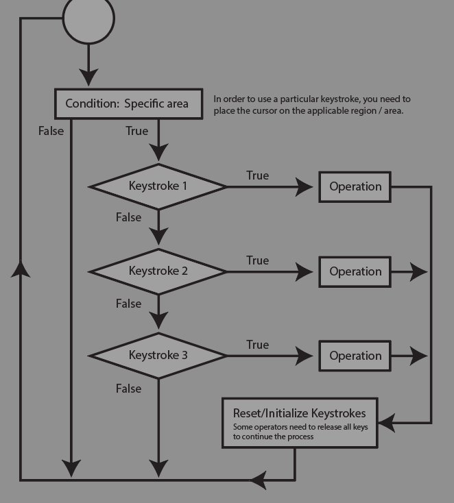
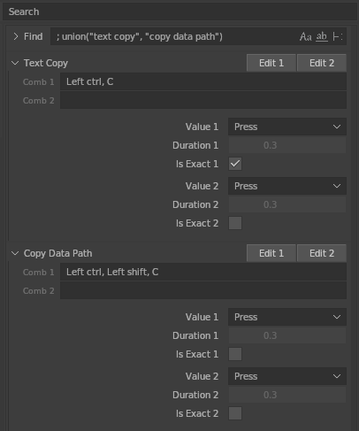
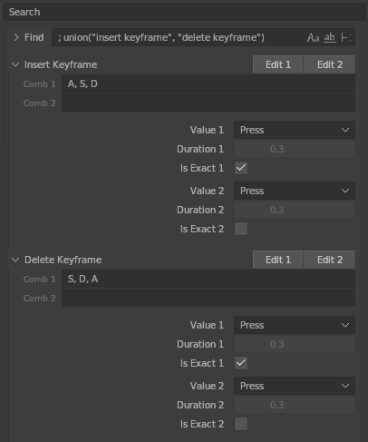
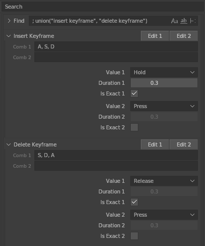

# Keymap Conflict

Conflict - That is, some Operator cannot be executed.

In this add-on, almost all keystroke behavior measurements are based on the following diagram:

 

In some cases, when you need to modify the default key mapping,  
you need to set some parameters for the key to avoid conflicts.

## Example A

Since **Text Copy** has higher priority, when you disable the "**Is Exact**" property and press `Ctrl` `Shift` `C`,  
it will trigger the action **Text Copy**, while **Copy Data Path** will never trigger.  
This means that when you enable ""**Is Exact**"", you need to press an equal number of keys to trigger.

## Example B

In this case, **Insert Keyframe** is changed to `A` `S` `D` and **Delete Keyframe** is changed to `S` `D` `A`.  
They are regarded as the same key combination, since **Delete Keyframe** has a higher priority, **Insert Keyframe** will never be executed.

 

If you want to map the same key combination to 2 actions. Consider setting one value to "**Hold**" and the other to "**Release**"

Now when you press `A` `S` `D` for more than 0.3 seconds, it will trigger **Insert key frame**, otherwise **Delete key frame**

*Most membrane keyboards do not respond when pressing multiple keys at the same time (Keyboard Ghosting). For complex keystrokes, we recommend using a supported keyboard (such as a mechanical keyboard)*
