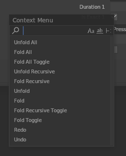

# Priority

Most key priority values ​​can be viewed by opening the **Context Menu** (*hold the right mouse button for 0.3 seconds by default*).  
And the top has highest priority

## Priority list
Undocumented, consider establishing.