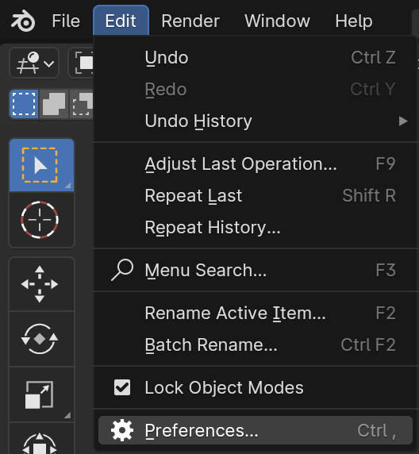
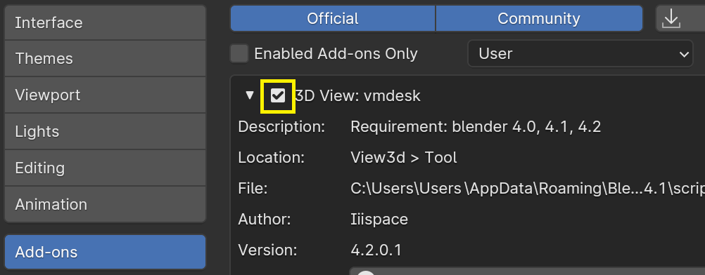

# **Install Updates**

You can install updates in the following 2 ways:  
- Blender UI
- Directly replace the original file

## Blender UI
Edit > Preferences

 

Uncheck the "**Disable Add-on**" button

 

Save Preferences and restart Blender.  
Then proceed to the installation steps: 

- [Installation](./installation.md)

---

Or remove the folder of the add-on file path, copy the new folder to the location. Then start Blender.