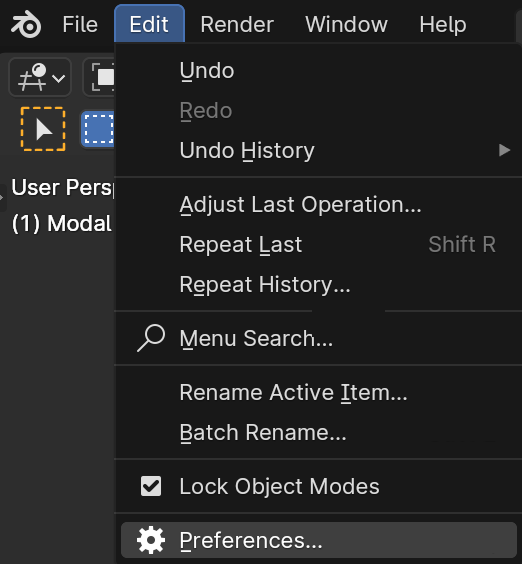
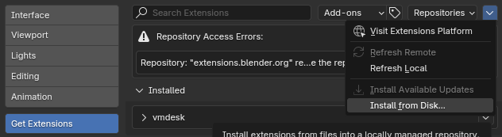
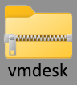
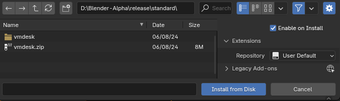
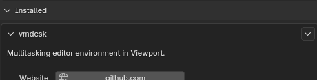
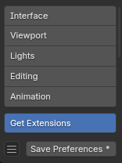

# **Installation**

## Requirements

blender 4.0 / 4.1 / 4.2

## Install

Edit > Preferences > Add-ons > Install

Unzip the file until you see the zip file named "**vmdesk**"

Select the zip file and press the "**Install Add-on**" button.

Wait a moment and the new tab will appear.

Enable the checkbox and press the "**Save Preferences**" button.

