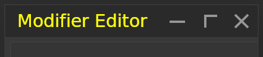
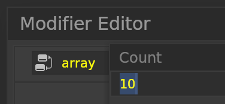
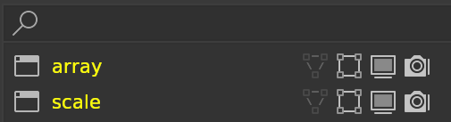
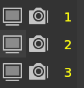

# **Foreground**

## <!--py$r_color_name("win_title_fg")$-->Window Title Bar FG<!---->
<!--py$r_color_description("win_title_fg")$-->Editor Title Bar foreground color<!---->

## <!--py$r_color_name("dd_title_fg")$-->Menu Title Bar FG<!---->
<!--py$r_color_description("dd_title_fg")$-->Menu Title Bar foreground color<!---->

## <!--py$r_color_name("box_text_fg")$-->Text Box FG<!---->
<!--py$r_color_description("box_text_fg")$-->Text Box foreground color<!---->

## <!--py$r_color_name("box_text_fg_ignore")$-->Text Box Inactive FG<!---->
<!--py$r_color_description("box_text_fg_ignore")$-->Text Box ignore foreground color<!---->

## <!--py$r_color_name("box_text_read_fg")$-->Read Only Text Box FG<!---->
<!--py$r_color_description("box_text_read_fg")$-->Read Only Text Box foreground color<!---->

## <!--py$r_color_name("box_val_fg")$-->Value Box FG<!---->
<!--py$r_color_description("box_val_fg")$-->Value Box foreground color<!---->

## <!--py$r_color_name("box_val_fg_ignore")$-->Value Box FG Disable<!---->
<!--py$r_color_description("box_val_fg_ignore")$-->Value Box disable foreground color<!---->

## <!--py$r_color_name("box_val_fg_error")$-->Value Box FG Error<!---->
<!--py$r_color_description("box_val_fg_error")$-->Value Box error foreground color<!---->

## <!--py$r_color_name("box_filter_fg")$-->Filter FG<!---->
<!--py$r_color_description("box_filter_fg")$-->Filter foreground color<!---->

## <!--py$r_color_name("box_filter_fg_info")$-->Filter Info FG<!---->
<!--py$r_color_description("box_filter_fg_info")$-->Filter Info foreground color<!---->

## <!--py$r_color_name("box_filter_fg_label")$-->Filter Label FG<!---->
<!--py$r_color_description("box_filter_fg_label")$-->Filter Label foreground color, modifier list number<!---->

## <!--py$r_color_name("box_filter_fg_apply")$-->Filter Label Apply FG<!---->
<!--py$r_color_description("box_filter_fg_apply")$-->Filter Label Apply foreground color<!---->

## <!--py$r_color_name("box_filter_fg_del")$-->Filter Label Delete FG<!---->
<!--py$r_color_description("box_filter_fg_del")$-->Filter Label Delete foreground color<!---->

## <!--py$r_color_name("box_setting_list_fg")$-->Settings List FG<!---->
<!--py$r_color_description("box_setting_list_fg")$-->Settings List foreground color<!---->

## <!--py$r_color_name("block_fg")$-->Blocks FG<!---->
<!--py$r_color_description("block_fg")$-->Blocks foreground color<!---->

## <!--py$r_color_name("block_fg_ignore")$-->Blocks FG Inactive<!---->
<!--py$r_color_description("block_fg_ignore")$-->Blocks foreground color (Inactive)<!---->

## <!--py$r_color_name("block_fg_info")$-->Blocks Info FG<!---->
<!--py$r_color_description("block_fg_info")$-->Blocks Info foreground color<!---->

## <!--py$r_color_name("box_button_fg")$-->Button FG<!---->
<!--py$r_color_description("box_button_fg")$-->Button foreground color<!---->

## <!--py$r_color_name("box_button_fg_ignore")$-->Button FG Disable<!---->
<!--py$r_color_description("box_button_fg_ignore")$-->Button disable foreground color<!---->

## <!--py$r_color_name("box_button_fg_info")$-->Button Info FG<!---->
<!--py$r_color_description("box_button_fg_info")$-->Button Info foreground color<!---->
