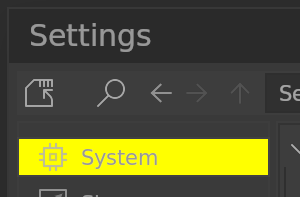
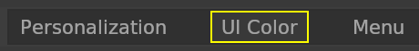

# **Hover**

## <!--py$r_color_name("box_area_hover")$-->Area Hover<!---->
<!--py$r_color_description("box_area_hover")$-->Area Hover color<!---->

## <!--py$r_color_name("box_area_hover_rim")$-->Area Hover Rim<!---->
<!--py$r_color_description("box_area_hover_rim")$-->Area Hover Rim color<!---->

## <!--py$r_color_name("box_filter_hover_bg")$-->Filter Area Hover BG<!---->
<!--py$r_color_description("box_filter_hover_bg")$-->Filter Area Hover background color<!---->

## <!--py$r_color_name("box_blfbutton_text_hover")$-->Button Text Hover<!---->
<!--py$r_color_description("box_blfbutton_text_hover")$-->Text Button hover color<!---->

## <!--py$r_color_name("box_blfbutton_text_hover_rim")$-->Button Text Hover Rim<!---->
<!--py$r_color_description("box_blfbutton_text_hover_rim")$-->Text Button hover rim color<!---->

## <!--py$r_color_name("win_title_hover")$-->Window Title Button Hover<!---->
<!--py$r_color_description("win_title_hover")$-->Editor Title Bar hover color<!---->

## <!--py$r_color_name("win_title_hover_red")$-->Window Title Close Button Hover<!---->
<!--py$r_color_description("win_title_hover_red")$-->Editor Title Bar Close Button hover color<!---->

## <!--py$r_color_name("win_title_hover_hold")$-->Window Title Button Hover Hold<!---->
<!--py$r_color_description("win_title_hover_hold")$-->Editor Title Bar hover color when pressing the key<!---->

## <!--py$r_color_name("win_title_hover_hold_red")$-->Window Title Close Button Hover Hold<!---->
<!--py$r_color_description("win_title_hover_hold_red")$-->Editor Title Bar Close Button hover color when pressing the key<!---->
