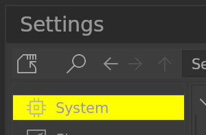
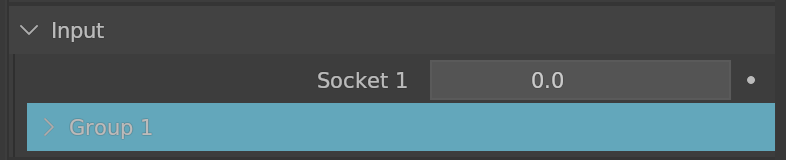
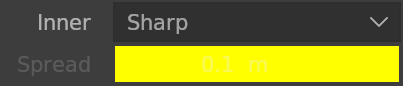
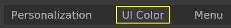
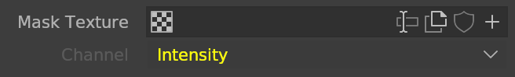
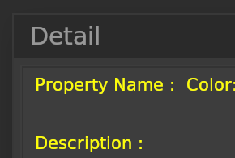
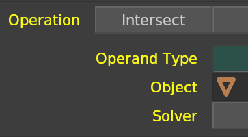

# **Menu**

## <!--py$r_color_name("dd_title")$-->Menu Title Bar BG<!---->
<!--py$r_color_description("dd_title")$-->Menu Title Bar background color<!---->

## <!--py$r_color_name("dd")$-->Menu BG<!---->
<!--py$r_color_description("dd")$-->Menu background color<!---->

## <!--py$r_color_name("dd_rim")$-->Menu Rim<!---->
<!--py$r_color_description("dd_rim")$-->Menu Rim color<!---->

## <!--py$r_color_name("dd_shadow")$-->Menu Drop Shadow<!---->
<!--py$r_color_description("dd_shadow")$-->Drop Down Menu drop shadow color<!---->

## <!--py$r_color_name("area")$-->Area BG<!---->
<!--py$r_color_description("area")$-->Area background color<!---->

## <!--py$r_color_name("box_area_region")$-->Area Region BG<!---->
<!--py$r_color_description("box_area_region")$-->Area Region background color<!---->

## <!--py$r_color_name("box_area_region_rim")$-->Area Region Rim<!---->
<!--py$r_color_description("box_area_region_rim")$-->Area Region Rim color<!---->

## <!--py$r_color_name("box_area_hover")$-->Area Hover<!---->
<!--py$r_color_description("box_area_hover")$-->Area Hover color<!---->

## <!--py$r_color_name("box_area_hover_rim")$-->Area Hover Rim<!---->
<!--py$r_color_description("box_area_hover_rim")$-->Area Hover Rim color<!---->

## <!--py$r_color_name("box_area_header_bg")$-->Area Header BG<!---->
<!--py$r_color_description("box_area_header_bg")$-->Area Header background color<!---->

## <!--py$r_color_name("block")$-->Blocks BG<!---->
<!--py$r_color_description("block")$-->Blocks background color<!---->

## <!--py$r_color_name("block_even")$-->Blocks BG Even<!---->
<!--py$r_color_description("block_even")$-->Even Block background color<!---->

## <!--py$r_color_name("block_title")$-->Blocks Title<!---->
<!--py$r_color_description("block_title")$-->Blocks Title color<!---->

## <!--py$r_color_name("block_title_even")$-->Blocks Title Even<!---->
<!--py$r_color_description("block_title_even")$-->Even Block Title color<!---->

## <!--py$r_color_name("block_calc_display")$-->Blocks Calculator Display BG<!---->
<!--py$r_color_description("block_calc_display")$-->Blocks Calculator Display background color<!---->

## <!--py$r_color_name("block_calc_display_fo")$-->Blocks Calculator Display BG Focus<!---->
<!--py$r_color_description("block_calc_display_fo")$-->Blocks Calculator Display focus background color<!---->

## <!--py$r_color_name("block_calc_button_bg")$-->Blocks Calculator Button BG<!---->
<!--py$r_color_description("block_calc_button_bg")$-->Blocks Calculator Button background color<!---->

## <!--py$r_color_name("block_fo")$-->Blocks Focus<!---->
<!--py$r_color_description("block_fo")$-->Blocks focus color<!---->

## <!--py$r_color_name("block_guideline0")$-->Blocks Guideline 0<!---->
<!--py$r_color_description("block_guideline0")$-->Blocks Guideline 0 color<!---->

## <!--py$r_color_name("block_guideline1")$-->Blocks Guideline 1<!---->
<!--py$r_color_description("block_guideline1")$-->Blocks Guideline 1 color<!---->

## <!--py$r_color_name("box_tb")$-->Taskbar BG<!---->
<!--py$r_color_description("box_tb")$-->Taskbar background color<!---->

## <!--py$r_color_name("box_tb_multibar")$-->Taskbar Underline<!---->
<!--py$r_color_description("box_tb_multibar")$-->The appearance when there are more than 2 editors of the same type<!---->

## <!--py$r_color_name("box_text_active")$-->Text Box Active BG<!---->
<!--py$r_color_description("box_text_active")$-->Active Text Box background color<!---->

## <!--py$r_color_name("box_text_fo")$-->Text Box Focus BG<!---->
<!--py$r_color_description("box_text_fo")$-->Text Box focus background color<!---->

## <!--py$r_color_name("box_text")$-->Text Box BG<!---->
<!--py$r_color_description("box_text")$-->Text Box background color<!---->

## <!--py$r_color_name("box_text_rim")$-->Text Box Rim<!---->
<!--py$r_color_description("box_text_rim")$-->Text Box Rim color<!---->

## <!--py$r_color_name("box_text_ignore")$-->Text Box BG Inactive<!---->
<!--py$r_color_description("box_text_ignore")$-->Text Box background color (Inactive)<!---->

## <!--py$r_color_name("box_text_rim_ignore")$-->Text Box Rim Inactive<!---->
<!--py$r_color_description("box_text_rim_ignore")$-->Text Box Rim color (Inactive)<!---->

## <!--py$r_color_name("box_text_read")$-->Read Only Text Box BG<!---->
<!--py$r_color_description("box_text_read")$-->Read Only Text Box background color<!---->

## <!--py$r_color_name("box_text_read_rim")$-->Read Only Text Box Rim<!---->
<!--py$r_color_description("box_text_read_rim")$-->Read Only Text Box Rim color<!---->

## <!--py$r_color_name("box_color_rim")$-->Color Box Rim<!---->
<!--py$r_color_description("box_color_rim")$-->Color Box Rim color<!---->

## <!--py$r_color_name("box_color_rim_fo")$-->Color Box Rim Focus<!---->
<!--py$r_color_description("box_color_rim_fo")$-->Color Box Rim focus color<!---->

## <!--py$r_color_name("box_val")$-->Value Box BG<!---->
<!--py$r_color_description("box_val")$-->Value Box background color<!---->

## <!--py$r_color_name("box_val_rim")$-->Value Box Rim<!---->
<!--py$r_color_description("box_val_rim")$-->Value Box Rim color<!---->

## <!--py$r_color_name("box_val_ignore")$-->Value Box BG Inactive<!---->
<!--py$r_color_description("box_val_ignore")$-->Value Box background color (Inactive)<!---->

## <!--py$r_color_name("box_val_rim_ignore")$-->Value Box Rim Inactive<!---->
<!--py$r_color_description("box_val_rim_ignore")$-->Value Box Rim color (Inactive)<!---->

## <!--py$r_color_name("box_val_fo")$-->Value Box Focus BG<!---->
<!--py$r_color_description("box_val_fo")$-->Value Box focus background color<!---->

## <!--py$r_color_name("box_val_active")$-->Value Box Active BG<!---->
<!--py$r_color_description("box_val_active")$-->Active Value Box background color<!---->

## <!--py$r_color_name("box_val_bool")$-->Check Box BG<!---->
<!--py$r_color_description("box_val_bool")$-->Check Box background color<!---->

## <!--py$r_color_name("box_val_bool_rim")$-->Check Box Rim<!---->
<!--py$r_color_description("box_val_bool_rim")$-->Check Box Rim color<!---->

## <!--py$r_color_name("box_val_bool_fo")$-->Check Box Focus<!---->
<!--py$r_color_description("box_val_bool_fo")$-->Check Box focus color<!---->

## <!--py$r_color_name("box_val_bool_ignore")$-->Check Box BG Inactive<!---->
<!--py$r_color_description("box_val_bool_ignore")$-->Check Box background color (Inactive)<!---->

## <!--py$r_color_name("box_val_bool_rim_ignore")$-->Check Box Rim Inactive<!---->
<!--py$r_color_description("box_val_bool_rim_ignore")$-->Check Box Rim color (Inactive)<!---->

## <!--py$r_color_name("box_button")$-->Button BG<!---->
<!--py$r_color_description("box_button")$-->Button background color<!---->

## <!--py$r_color_name("box_button_rim")$-->Button Rim<!---->
<!--py$r_color_description("box_button_rim")$-->Button Rim color<!---->

## <!--py$r_color_name("box_button_ignore")$-->Button BG Inactive<!---->
<!--py$r_color_description("box_button_ignore")$-->Button background color (Inactive)<!---->

## <!--py$r_color_name("box_button_rim_ignore")$-->Button Rim Inactive<!---->
<!--py$r_color_description("box_button_rim_ignore")$-->Button Rim color (Inactive)<!---->

## <!--py$r_color_name("box_button_fo")$-->Button Focus<!---->
<!--py$r_color_description("box_button_fo")$-->Button focus color<!---->

## <!--py$r_color_name("box_button_rim_fo")$-->Button Rim Focus<!---->
<!--py$r_color_description("box_button_rim_fo")$-->Button Rim focus color<!---->

## <!--py$r_color_name("box_button_active")$-->Button Active BG<!---->
<!--py$r_color_description("box_button_active")$-->Active Button background color<!---->

## <!--py$r_color_name("box_button_rim_active")$-->Button Rim Active<!---->
<!--py$r_color_description("box_button_rim_active")$-->Active Button Rim color<!---->

## <!--py$r_color_name("box_buttonoff")$-->Button Switch Off BG<!---->
<!--py$r_color_description("box_buttonoff")$-->Button Switch background color when button value is False<!---->

## <!--py$r_color_name("box_buttonoff_rim")$-->Button Switch Off Rim<!---->
<!--py$r_color_description("box_buttonoff_rim")$-->Button Switch Rim color when button value is False<!---->

## <!--py$r_color_name("box_buttonoff_fo")$-->Button Switch Off Focus<!---->
<!--py$r_color_description("box_buttonoff_fo")$-->Button Switch focus color when button value is False<!---->

## <!--py$r_color_name("box_buttonoff_rim_fo")$-->Button Switch Off Rim Focus<!---->
<!--py$r_color_description("box_buttonoff_rim_fo")$-->Button Switch Rim focus color when button value is False<!---->

## <!--py$r_color_name("box_buttonon")$-->Button Switch On BG<!---->
<!--py$r_color_description("box_buttonon")$-->Button Switch background color when button value is True<!---->

## <!--py$r_color_name("box_buttonon_rim")$-->Button Switch On Rim<!---->
<!--py$r_color_description("box_buttonon_rim")$-->Button Switch Rim color when button value is True<!---->

## <!--py$r_color_name("box_buttonon_fo")$-->Button Switch On Focus<!---->
<!--py$r_color_description("box_buttonon_fo")$-->Button Switch focus color when button value is True<!---->

## <!--py$r_color_name("box_buttonon_rim_fo")$-->Button Switch On Rim Focus<!---->
<!--py$r_color_description("box_buttonon_rim_fo")$-->Button Switch Rim focus color when button value is True<!---->

## <!--py$r_color_name("box_buttonon_ignore")$-->Button Switch On BG Inactive<!---->
<!--py$r_color_description("box_buttonon_ignore")$-->Button Switch background color when button value is True (Inactive)<!---->

## <!--py$r_color_name("box_filter")$-->Filter Area BG<!---->
<!--py$r_color_description("box_filter")$-->Filter Area background color<!---->

## <!--py$r_color_name("box_filter_rim")$-->Filter Area Rim<!---->
<!--py$r_color_description("box_filter_rim")$-->Filter Area Rim color<!---->

## <!--py$r_color_name("box_filter_num_modal")$-->Filter Hover Element BG<!---->
<!--py$r_color_description("box_filter_num_modal")$-->Sorting modal active element background color<!---->

## <!--py$r_color_name("box_filter_num_modal_rim")$-->Filter Hover Element Rim<!---->
<!--py$r_color_description("box_filter_num_modal_rim")$-->Sorting modal active element rim color<!---->

## <!--py$r_color_name("box_filter_region")$-->Filter Region BG<!---->
<!--py$r_color_description("box_filter_region")$-->Filter Region background color, modifier list button region<!---->

## <!--py$r_color_name("box_filter_region_rim")$-->Filter Region Rim<!---->
<!--py$r_color_description("box_filter_region_rim")$-->Filter Region Rim color, modifier list button region<!---->

## <!--py$r_color_name("box_filter_active_bg")$-->Filter Area Active Element BG<!---->
<!--py$r_color_description("box_filter_active_bg")$-->Filter Area Active Element background color<!---->

## <!--py$r_color_name("box_filter_select_bg")$-->Filter Area Selected Element BG<!---->
<!--py$r_color_description("box_filter_select_bg")$-->Filter Area Selected Element background color<!---->

## <!--py$r_color_name("box_filter_hover_bg")$-->Filter Area Hover BG<!---->
<!--py$r_color_description("box_filter_hover_bg")$-->Filter Area Hover background color<!---->

## <!--py$r_color_name("box_cursor_beam")$-->I Beam Cursor<!---->
<!--py$r_color_description("box_cursor_beam")$-->I-Beam cursor color<!---->

## <!--py$r_color_name("box_cursor_beam_off")$-->I Beam Cursor Off<!---->
<!--py$r_color_description("box_cursor_beam_off")$-->I-Beam cursor color off<!---->

## <!--py$r_color_name("box_text_selection")$-->Text Selection<!---->
<!--py$r_color_description("box_text_selection")$-->Text Selection background Color in Text Box<!---->

## <!--py$r_color_name("box_text_selection_off")$-->Text Selection Off<!---->
<!--py$r_color_description("box_text_selection_off")$-->Text Selection Off background Color in Text Box<!---->

## <!--py$r_color_name("box_scrollbar_bg")$-->Filter Scrollbar BG<!---->
<!--py$r_color_description("box_scrollbar_bg")$-->Filter Scrollbar background color<!---->

## <!--py$r_color_name("box_scrollbar")$-->Filter Scrollbar<!---->
<!--py$r_color_description("box_scrollbar")$-->Filter Scrollbar color<!---->

## <!--py$r_color_name("box_block_scrollbar_bg")$-->Blocks Scrollbar BG<!---->
<!--py$r_color_description("box_block_scrollbar_bg")$-->Blocks Scrollbar background color<!---->

## <!--py$r_color_name("box_block_scrollbar")$-->Blocks Scrollbar<!---->
<!--py$r_color_description("box_block_scrollbar")$-->Blocks Scrollbar color<!---->

## <!--py$r_color_name("box_setting_list_bg")$-->Settings List BG<!---->
<!--py$r_color_description("box_setting_list_bg")$-->Settings List background color<!---->

## <!--py$r_color_name("box_setting_list_active")$-->Settings List Active BG<!---->
<!--py$r_color_description("box_setting_list_active")$-->Settings List active background color<!---->

## <!--py$r_color_name("box_setting_list_active_rim")$-->Settings List Active Rim<!---->
<!--py$r_color_description("box_setting_list_active_rim")$-->Settings List active rim color<!---->

## <!--py$r_color_name("box_blfbutton_text_hover")$-->Button Text Hover<!---->
<!--py$r_color_description("box_blfbutton_text_hover")$-->Text Button hover color<!---->

## <!--py$r_color_name("box_blfbutton_text_hover_rim")$-->Button Text Hover Rim<!---->
<!--py$r_color_description("box_blfbutton_text_hover_rim")$-->Text Button hover rim color<!---->

## <!--py$r_color_name("box_hue_bg")$-->Hue BG<!---->
<!--py$r_color_description("box_hue_bg")$-->Color Panel Hue background color<!---->

## <!--py$r_color_name("box_selectbox_bg")$-->Select Box BG<!---->
<!--py$r_color_description("box_selectbox_bg")$-->Select Box background color<!---->

## <!--py$r_color_name("box_selectbox_rim")$-->Select Box Rim<!---->
<!--py$r_color_description("box_selectbox_rim")$-->Select Box Rim color<!---->

## <!--py$r_color_name("box_selectbox_gap")$-->Select Box Gap<!---->
<!--py$r_color_description("box_selectbox_gap")$-->Select Box Gap color<!---->

## <!--py$r_color_name("box_selectbox_subtract_bg")$-->Select Box Subtract BG<!---->
<!--py$r_color_description("box_selectbox_subtract_bg")$-->Select Box Subtract background color<!---->

## <!--py$r_color_name("box_selectbox_subtract_rim")$-->Select Box Subtract Rim<!---->
<!--py$r_color_description("box_selectbox_subtract_rim")$-->Select Box Subtract Rim color<!---->

## <!--py$r_color_name("box_selectbox_subtract_gap")$-->Select Box Subtract Gap<!---->
<!--py$r_color_description("box_selectbox_subtract_gap")$-->Select Box Subtract Gap color<!---->

## <!--py$r_color_name("dd_title_fg")$-->Menu Title Bar FG<!---->
<!--py$r_color_description("dd_title_fg")$-->Menu Title Bar foreground color<!---->

## <!--py$r_color_name("box_text_fg")$-->Text Box FG<!---->
<!--py$r_color_description("box_text_fg")$-->Text Box foreground color<!---->

## <!--py$r_color_name("box_text_fg_ignore")$-->Text Box Inactive FG<!---->
<!--py$r_color_description("box_text_fg_ignore")$-->Text Box ignore foreground color<!---->

## <!--py$r_color_name("box_text_read_fg")$-->Read Only Text Box FG<!---->
<!--py$r_color_description("box_text_read_fg")$-->Read Only Text Box foreground color<!---->

## <!--py$r_color_name("box_val_fg")$-->Value Box FG<!---->
<!--py$r_color_description("box_val_fg")$-->Value Box foreground color<!---->

## <!--py$r_color_name("box_val_fg_ignore")$-->Value Box FG Disable<!---->
<!--py$r_color_description("box_val_fg_ignore")$-->Value Box disable foreground color<!---->

## <!--py$r_color_name("box_val_fg_error")$-->Value Box FG Error<!---->
<!--py$r_color_description("box_val_fg_error")$-->Value Box error foreground color<!---->

## <!--py$r_color_name("box_filter_fg")$-->Filter FG<!---->
<!--py$r_color_description("box_filter_fg")$-->Filter foreground color<!---->

## <!--py$r_color_name("box_filter_fg_info")$-->Filter Info FG<!---->
<!--py$r_color_description("box_filter_fg_info")$-->Filter Info foreground color<!---->

## <!--py$r_color_name("box_filter_fg_label")$-->Filter Label FG<!---->
<!--py$r_color_description("box_filter_fg_label")$-->Filter Label foreground color, modifier list number<!---->

## <!--py$r_color_name("box_filter_fg_apply")$-->Filter Label Apply FG<!---->
<!--py$r_color_description("box_filter_fg_apply")$-->Filter Label Apply foreground color<!---->

## <!--py$r_color_name("box_filter_fg_del")$-->Filter Label Delete FG<!---->
<!--py$r_color_description("box_filter_fg_del")$-->Filter Label Delete foreground color<!---->

## <!--py$r_color_name("box_setting_list_fg")$-->Settings List FG<!---->
<!--py$r_color_description("box_setting_list_fg")$-->Settings List foreground color<!---->

## <!--py$r_color_name("block_fg")$-->Blocks FG<!---->
<!--py$r_color_description("block_fg")$-->Blocks foreground color<!---->

## <!--py$r_color_name("block_fg_ignore")$-->Blocks FG Inactive<!---->
<!--py$r_color_description("block_fg_ignore")$-->Blocks foreground color (Inactive)<!---->

## <!--py$r_color_name("block_fg_info")$-->Blocks Info FG<!---->
<!--py$r_color_description("block_fg_info")$-->Blocks Info foreground color<!---->

## <!--py$r_color_name("box_button_fg")$-->Button FG<!---->
<!--py$r_color_description("box_button_fg")$-->Button foreground color<!---->

## <!--py$r_color_name("box_button_fg_ignore")$-->Button FG Disable<!---->
<!--py$r_color_description("box_button_fg_ignore")$-->Button disable foreground color<!---->

## <!--py$r_color_name("box_button_fg_info")$-->Button Info FG<!---->
<!--py$r_color_description("box_button_fg_info")$-->Button Info foreground color<!---->

