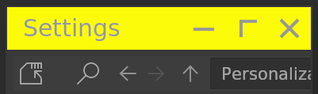
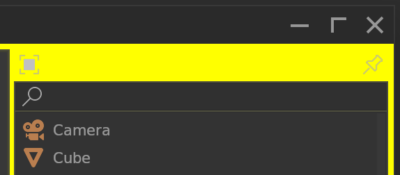

# **Window**

## <!--py$r_color_name("win_title")$-->Window Title Bar BG<!---->
<!--py$r_color_description("win_title")$-->Editor Title Bar background color<!---->

## <!--py$r_color_name("win_title_inactive")$-->Window Inactive Title Bar BG<!---->
<!--py$r_color_description("win_title_inactive")$-->Editor Inactive Title Bar background color<!---->

## <!--py$r_color_name("win")$-->Window BG<!---->
<!--py$r_color_description("win")$-->Editor background color<!---->

## <!--py$r_color_name("win_inactive")$-->Window Inactive BG<!---->
<!--py$r_color_description("win_inactive")$-->No function, spare.<!---->

## <!--py$r_color_name("win_rim")$-->Window Rim<!---->
<!--py$r_color_description("win_rim")$-->Editor Rim color<!---->

## <!--py$r_color_name("win_shadow")$-->Window Drop Shadow<!---->
<!--py$r_color_description("win_shadow")$-->Editor drop shadow color<!---->

## <!--py$r_color_name("win_title_fg")$-->Window Title Bar FG<!---->
<!--py$r_color_description("win_title_fg")$-->Editor Title Bar foreground color<!---->

## <!--py$r_color_name("win_title_hover")$-->Window Title Button Hover<!---->
<!--py$r_color_description("win_title_hover")$-->Editor Title Bar hover color<!---->

## <!--py$r_color_name("win_title_hover_red")$-->Window Title Close Button Hover<!---->
<!--py$r_color_description("win_title_hover_red")$-->Editor Title Bar Close Button hover color<!---->

## <!--py$r_color_name("win_title_hover_hold")$-->Window Title Button Hover Hold<!---->
<!--py$r_color_description("win_title_hover_hold")$-->Editor Title Bar hover color when pressing the key<!---->

## <!--py$r_color_name("win_title_hover_hold_red")$-->Window Title Close Button Hover Hold<!---->
<!--py$r_color_description("win_title_hover_hold_red")$-->Editor Title Bar Close Button hover color when pressing the key<!---->

