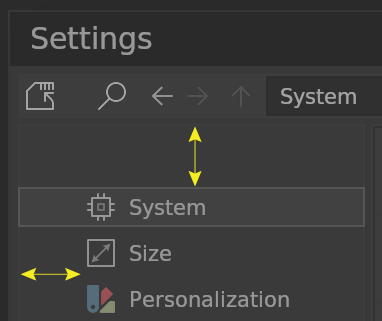
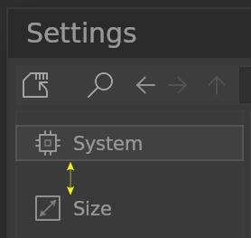

# **Settings List**

## Outer

Outer border size of the Settings Editor category list. Default is 8 pixels.

## Inner

Inner border size of the Settings Editor category list. Default is 5 pixels.

## Hover Rim

No function, spare.
