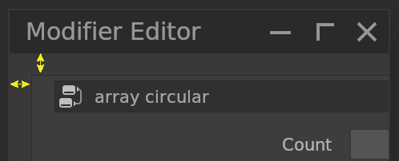
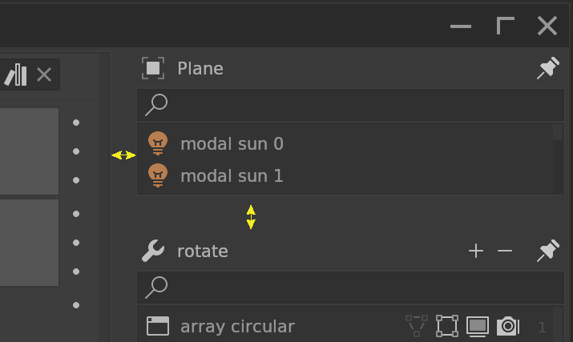
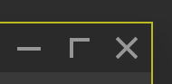

# **Window Border**

## Outer

Editor outer border. Default is 4 pixels.

## Inner

Editor inner border. Default is 3 pixels.

## Rim

Editor rim. Default is 1 pixel.

## Widget Rim

Widget rim. Default is 1 pixel.

