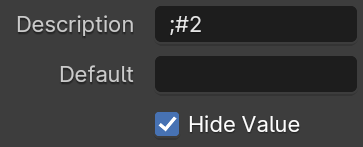
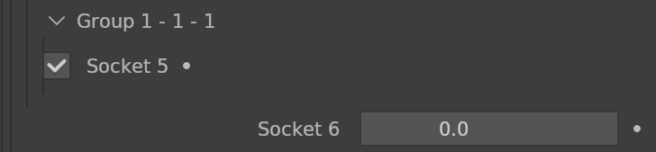

<div style="background-color: #909190; padding: 40px;">

# Geometry Nodes
The editor can add a new subgroup of Sockets, the format of which is stored in the socket description.


## Geometry Node Modifier Indentation Format

To use the Indentation Format, you need to add a semicolon at the beginning of the socket description.
```
;#0;sep(1);  Socket description..
```


### Indent
Indent to level 1.
```
;#1
```

### Unindent
Unindent to level 0.
```
;#0
```

### Title Indent
Show title only when indented.

Enable the **Hide Value** property.



### Separator
```
;sep(x)
    Parameters:
        x (float)
```


### Alignment
```
;align(x)
    Parameters:
        x : 
            hide : Hide the socket
            title : boolean title
            right : Align right
```

```
;align(title)
```


```
;#1;align(right)
```

